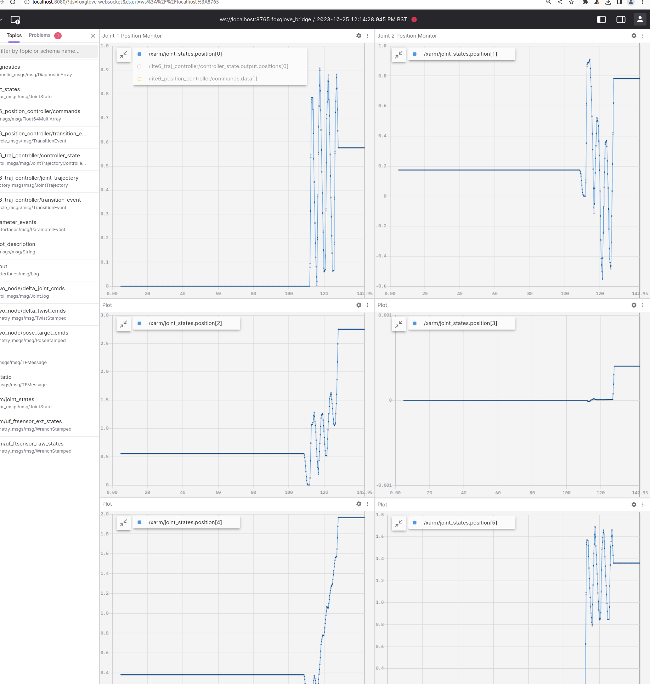

[](https://github.com/ipab-rad/lite6_ws/blob/rolling/.github/workflows/control.yaml) [](https://github.com/ipab-rad/lite6_ws/blob/rolling/.github/workflows/motion_planning.yaml) [](https://github.com/ipab-rad/lite6_ws/blob/rolling/.github/workflows/zed.yaml)

# IMPORTANT: This repository is a work in progress, once it is in a stable state this message will be removed.

# ROS 2 Robot Learning Workspace 🚀 
This repository serves as a template for setting up a ROS 2 workspace for performing robot learning research. In order to run the code in this repository with a given robot, you simply need to change description packages that integrate the robot with `MoveIt` and `ROS 2 Control`, a guide for doing this will be added in future. 

Most of the application code within this repository is intended to be run using Docker, with this being said, it is possible to build the ROS workspace on the host of a machine running Ubuntu 22.04. 

Tutorials for the following applications are included:

* Camera calibration (intrinsic + extrinsic parameters)
* Control (interfacing with ROS 2 Controllers)
* Motion Planning (using MoveIt 2 for motion planning)
* Policy Deployment (deploying neural network policies on the robot)

The following tutorials are considered be added in future:

* Teleoperation
* Grasp Pose Estimation
* Data Collection + Converting ROS 2 MCAP data to RLDS 

If you use ROS 2 and are interested in contributing to this codebase please reach out at peterdavidfagan@gmail.com. If you use these tools in your research please star this repository. 


## Supported Robots 🤖
A list of robots operated using this codebase (with minor alterations). I am open to starting a template repo with branches for each robot that is supported.

* UFactory Lite6
* Franka Emika Panda

# Hardware Setup 🔧

## Components
* UFactory Lite6
* Intel NUC (Intel i5 as minimum CPU spec)
* Client machine (Nvidia GPU that supports CUDA 12+)
* Ethernet switch
* Zed camera


# Software Setup

## System Software Prerequisites
This workspaces requires the following software to be installed:

* An installation of Docker ([instructions](https://docs.docker.com/engine/install/ubuntu/))
* An installation of Nvidia Container Toolkit (if you intend to use cameras + policy deployment) ([instructions](https://docs.nvidia.com/datacenter/cloud-native/container-toolkit/latest/install-guide.html))
* An installation of ROS rolling ([instructions](https://docs.ros.org/en/rolling/Installation.html))

# NUC Machine Setup
* Install Docker
* Perform Realtime Patch of Kernel
* CPU frequency scaling
* Set static IP
* Turns on SSH service
* Disables display manager

Run the following script to accomplish the above steps and setup your NUC:

```bash
./nuc_setup.sh
```


# Client Machine Setup
** Incomplete

* Set static IP
* Set XAUTH variables to enable X11 forwarding

Run the following script to accomplish the above steps and setup your NUC:
```bash
client_machine_setup.sh
```

## Running ROS Applications on Host
In order to install and build all workspace dependencies on your local machine all you need to run is:
```bash
./local_setup.sh
```

This is only necessary if you wish to run application code directly on the host machine, most applications within this repository are dockerised and hence don't require you to build the ROS 2 workspace on the host machine.

## Running ROS Applications with Docker
The following guides are recommended as background reading for this section:

* [Docker Guide](https://docs.docker.com/get-started/) 
* [Docker Compose](https://docs.docker.com/compose/)
* [Docker Swarm](https://docs.docker.com/engine/swarm/)

### Docker Application Deployment
The `.docker` folder of this repository contains multiple subfolders which docker compose files that can be used to deploy containers across machines within the LAN. 

### Docker Swarm Configuration
**Incomplete 

1. Initialize swarm on client machine
2. Make client machine a swarm manager
3. Add NUC and other devices as Nodes within the swarm

### Docker GUI Prerequisites
If you wish to run a container that contains GUI applications (e.g. rviz) you need to first manage X-server authentication. The most basic way to do so is through enabling access to all local applications by running: 

```
xhost +local:
```

This is in general bad practice as it disables security settings for local applications. In order to authenticate the docker container alone the following command needs to be run to populate a temporary file which our docker build will use:

```
export DOCKER_XAUTH=/tmp/.docker.xauth
touch $DOCKER_XAUTH
xauth nlist $DISPLAY | sed -e 's/^..../ffff/' | xauth -f $DOCKER_XAUTH nmerge -
```

## Running Tutorials Examples

### Camera Calibration Tutorial

### Control Tutorial

Note: in its current state, for visualization code to work one needs to run the foxglove bridge on the host machine with 

```
ros2 run foxglove_bridge foxglove_bridge
```

In future this bridge will be moved to a docker container and launched as a service with the application.

Start the application code (control server, servo node, foxglove visualization):
```bash
cd .docker/control
docker compose -f docker-compose-servo-application.yaml  up
```

In order to view the default dashboard configuration open [http://localhost:8080](http://localhost:8080/).



Run example trajectory code: 
```bash
source /opt/ros/rolling/setup.bash
python ./src/tutorials/control/src/servo.py 
```

Please see [control_tutorial](placeholder.com) for further instructions.

### Motion Planning Tutorial
```bash
ros2 launch 
```
Please see [motion_planning_tutorial](placeholder.com) for further instructions.

### Policy Deployment Tutorial
```bash
ros2 launch 
```
Please see [policy_deployment_tutorial](placeholder.com) for further instructions.
